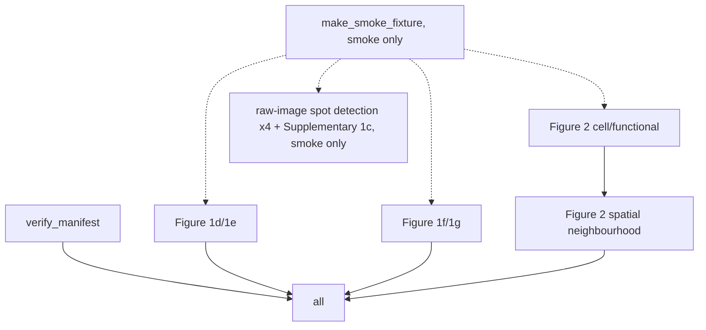

# NanoSTAMP

A reproducible workflow for the NanoSTAMP study's LNP-barcode spot detection
and downstream spleen-imaging analysis. Ported from the Hickey Lab's
[`NanoSTAMP`](https://github.com/HickeyLab/NanoSTAMP) notebook repository into
a Snakemake pipeline with an importable library, a pinned environment and
tests. All credit for the underlying method and data belongs to the Hickey
Lab; cite the associated manuscript.

## Analysis overview

The study detects lipid-nanoparticle (LNP) barcodes in multiplexed spleen
imaging and relates barcode-positive cells to cell type, spatial
neighbourhood and functional readouts (luciferase and OVA-antigen expression,
SIINFEKL-H-2Kb/CD86 dendritic-cell presentation). It supports:

- **Figure 1d/1e** - spatial-tile and cell-type-composition analysis of
  single-oligo (Bit_1) versus full-barcode (codebook-matched) LNP calls in
  PBS and SM-102 LNP-treated spleen.
- **Figure 1f/1g** - spatial-neighbourhood clustering of the SM-102
  LNP-treated spleen and neighbourhood abundance among LNP+/LNP− cells.
- **Figure 2 and Supplementary Figures 6-8** - multiplex LNP uptake,
  cell-type composition and enrichment, and Luc/OVA/SIINFEKL-H-2Kb
  functional-readout analysis across ten LNP formulations.
- **Figure 2 and Supplementary Figures 9-11** - multiplex spatial
  neighbourhood analysis built on the Figure 2 annotated dataset.
- **Supplementary Figure 1c** - two-oligo RCA-FISH spot detection,
  segmentation and per-cell barcode classification.

## Data sources

Processed data are deposited in the Duke Research Data Repository:
<https://research.repository.duke.edu/record/554?ln=en> (folder `For
Repository`). Raw and registered TIFF stacks are not deposited anywhere and
are excluded from this repository, exactly as in the upstream release.

**This record could not be downloaded from this environment.** Its dynamic
pages sit behind an AWS WAF bot challenge (HTTP 202 with an
`x-amzn-waf-action: challenge` header) that blocks headless HTTP clients,
including `curl` with a browser user agent and this workflow's own fetch
tooling; `robots.txt` alone is reachable. Downloading it needs a real browser
session. To reproduce the downstream figures:

1. Open the record URL in a browser and download the `For Repository` folder.
2. Rename it `Data`, or place its contents under `data/` matching the layout
   in the original upstream README (one subdirectory per figure, e.g.
   `data/Figure_1d_1e_Spleen_LNP/Precomputed_Analysis_Input/`).
3. Compute each file's SHA-256 (`sha256sum <file>`) and populate
   `config/data_manifest.yaml`, then run `pixi run verify_manifest`.
4. Run `pixi run all`.

Because the data could not be fetched here, `pixi run all` has not been run
against real data in this port; `pixi run smoke` (below) exercises the whole
DAG, including every raw-image rule, against a synthetic fixture instead.

## One-command reproduction

```bash
pixi run smoke   # whole DAG, synthetic fixture, ~1 minute on CPU
pixi run test    # unit tests
pixi run lint    # ruff + pyrefly
pixi run all     # real data, once downloaded per "Data sources" above
```

## Local directory structure

```text
NanoSTAMP/
├── config/            # config.yaml (real), smoke.yaml (synthetic fixture), data_manifest.yaml
├── src/nanostamp/      # library: spot detection, spleen LNP, neighbourhoods, cell/functional analysis
├── workflow/
│   ├── Snakefile
│   ├── rules/*.smk
│   └── scripts/*.py    # thin Snakemake entry points calling the library
├── tests/
├── data/               # gitignored; downloaded processed data goes here
└── results/            # gitignored; workflow outputs go here
```

## Config reference

`config/config.yaml` lists every parameter, seed and path the original
notebooks hardcoded, grouped by figure: tile sizes and cell-type cutoffs
(Figure 1d/1e), k-nearest-neighbour and cluster counts (Figure 1f/1g, Figure
2 neighbourhoods), the ten-entry LNP-formulation table, reference-region
positivity-threshold quantiles (Figure 2 cell/functional), and per-notebook
spot-detection
thresholds (raw-image rules). `config/smoke.yaml` overrides the data root to
a synthetic fixture and shrinks every cluster/elbow parameter so the whole
DAG runs in under a minute.

## DAG



## Outputs

Each analysis rule writes its tables under
`results/<figure>/tables/*.csv`; `figure_2_cell_functional` additionally
writes the merged `Figure_2_annotated_cells.h5ad` consumed by
`figure_2_spatial_neighborhood`. No committed figure image files are shipped;
regenerate them by running the workflow.

## Parity with upstream

The upstream notebooks are distributed **without stored outputs or execution
counts** (confirmed: zero cells across all nine notebooks have a stored
`outputs` array), so there is no notebook-recorded number to diff a ported
run against. Because the Duke deposit could not be downloaded here (see
"Data sources"), no real-data run has been produced either. `~/planning/NanoSTAMP/parity.md`
records this and the full state of the port; the summary is: fidelity was
checked by re-deriving each notebook's computation as a pure function against
hand-computed small fixtures (see `tests/`), not by comparing against a
stored reference number, because no such number exists upstream or is
reachable here.

## Differences from upstream

**Bug fixes** (each with a regression test; a config flag restores the
upstream value where the fix changes a reported number):

- `figure_2_cell_functional.fix_bcell_uptake_denominator_bug` (default
  `true`): the B-cell uptake-vs-OVA-transfection correlation
  (`compute_bcell_uptake_vs_ova_correlation`) computed its uptake-percentage
  denominator over every row with `cell_type == 'B'`, including the
  synthetic `Tissue_average` row, inflating it. Set to `false` for the
  upstream value.
- `figure_2_spatial_neighborhood.robust_self_exclusion` (default `true`): the
  source notebook excluded a cell from its own k-nearest-neighbour window by
  positionally dropping the first returned neighbour column, assuming it is
  always the self match; when two cells share exact coordinates this can
  keep a duplicate-location neighbour and drop a true nearest neighbour. The
  default instead matches the query's own index (as every other helper in
  the same notebook already does) and excludes that. Set to `false` for the
  upstream behaviour.
- The full-barcode raw-image codebook's expected bit weight is corrected to
  6 (the literal library string `100110100011` has six `1`s); the porting
  notes for that notebook stated 5, and `BarcodeCodebook` validates its own
  weight against the library at construction time, which is what caught this.

**Intentional deviations**, documented rather than silently ported:

- **Raw-image spot detection is a generic, configurable port, not five
  near-duplicated notebooks.** The five raw-image notebooks share two
  algorithms (LoG-candidate detection + Hamming-distance barcode decoding;
  Cellpose/threshold nuclear segmentation), each with different marker
  panels and thresholds; `nanostamp.spot_detection` implements each
  algorithm once, parameterised by `config.yaml`. The port covers detection
  and decoding at a fixed threshold only. Per-run threshold calibration
  (grid search over PBS/positive control fields), the tiled, checkpointed
  processing the original notebooks needed for hundred-gigabyte stacks, the
  optional CuPy GPU path, and the raw-intensity "rescue" candidate pass stay
  out of scope, since none of them change a decoded barcode for a given
  threshold and none are exercisable without the excluded raw images. These
  rules run only once a user supplies real TIFFs; `pixi run smoke` exercises
  the same code path against a tiny synthetic stack instead.
- **Figure 2 spatial-neighbourhood Sections 8-11 stay out of scope.** The
  source notebook continues past the neighbourhood clustering (ported in
  full) into roughly fifteen near-identical paired-region distance/marker
  analyses between LNP_08- and LNP_10-positive dendritic, CD8, CD4 and B
  cells. Two shared, reusable functions are ported
  (`collect_neighbor_pairs`, `paired_region_ttest`) so any of those
  analyses can be built from them; the ~30 individual output tables each
  stay as a documented gap rather than a named function, listed in
  `nanostamp.spatial_neighborhood`'s module docstring.
- **Figure 2 cell/functional Sections 9-10 stay as workflow concerns, not
  library functions.** Section 9 is a three-region spatial overlay figure
  and Section 10 re-derives plot data from tables already computed in
  Sections 3-8; neither adds new computation.
- Every `savefig`/`plt.show()` in the source notebooks is inert (confirmed:
  no notebook actually writes a PDF/PNG despite several printing `"Saved:
  ..."`); this port's rules do write real PDF/PNG figures where a figure is
  produced, via `nanostamp.plotting.save_figure`.
- Supplementary Figure 1c's Fiji tile-stitching step is out of scope: it
  produces a visual QC preview only and both the real notebook and this port
  run spot detection and segmentation on individual FOV tiles, not the
  stitched image.

## Licence

Upstream (`HickeyLab/NanoSTAMP`) publishes no licence; this repository does
not add one it is not entitled to grant. The ported code here has no licence
grant beyond what upstream permits.
